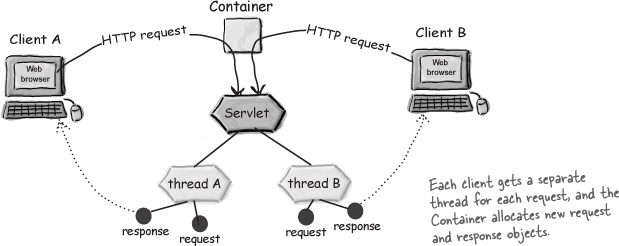

# Req 1: Measure that Spring Boot applications consume less resources

Spring Boot add support for Servlet containers using the following `Spring boot Starter`:

```
<dependency>
    <groupId>org.springframework.boot</groupId>
    <artifactId>spring-boot-starter-web</artifactId>
</dependency>
``` 

Servlet containers implements the Threading model, **One Thread per Request/Response**.



Source: https://www.oreilly.com/library/view/head-first-servlets/9780596516680/ch04s04.html

## Scenarios to analyze

### Scenario 1: Calculate performance with multiple parameters

- Parameter 1: User load: [50, 100, 200, 300] users
- Parameter 2: Process time: [0,5, 1, 2, 5] seconds

### Tooling

For the tests, we will use **Jmeter** with the following plugins:

- https://jmeter-plugins.org/wiki/ThroughputShapingTimer/

## References

- https://alpitanand20.medium.com/tomcat-why-just-200-default-threads-febd2411b904
- https://velog.io/@jihoson94/EventLoopModelInSpring
- https://docs.spring.io/spring-boot/docs/current/reference/html/application-properties.html
- https://www.baeldung.com/spring-boot-configure-tomcat
- https://sihyung92.oopy.io/spring/1
- https://docstore.mik.ua/orelly/java-ent/servlet/ch03_04.htm
- https://www.tutorialspoint.com/servlets/servlets-life-cycle.htm